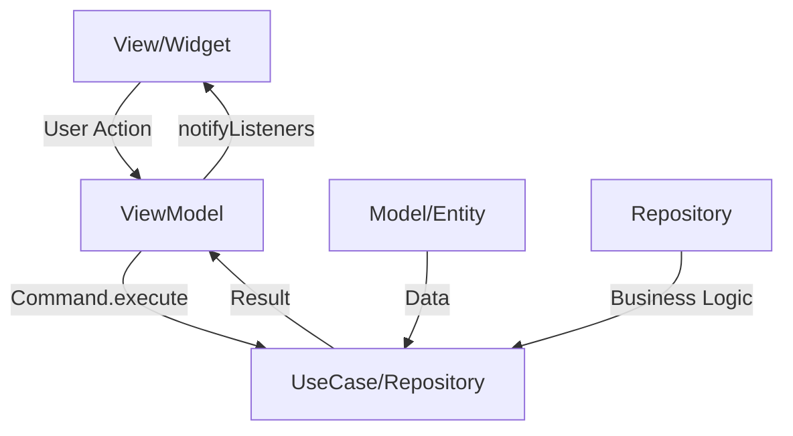

# 🏗️ Arquitetura MVVM

## 📋 Conceitos Fundamentais

### O que é MVVM?

**MVVM (Model-View-ViewModel)** é um padrão arquitetural que promove a separação de responsabilidades entre:

- **Model**: Dados e lógica de negócio
- **View**: Interface do usuário (UI)
- **ViewModel**: Mediador entre View e Model

## 🎯 Implementação no Projeto

### Estrutura Básica

```
lib/
├── ui/                     # VIEW LAYER
│   ├── todo/
│   │   ├── viewmodels/     # ViewModels
│   │   └── widgets/        # UI Components
│   └── todo_details/
├── domain/                 # MODEL LAYER
│   ├── models/             # Entidades
│   └── use_cases/          # Regras de negócio
└── data/                   # DATA LAYER
    ├── repositories/       # Abstração de dados
    └── services/           # Implementações
```

## 🔄 Fluxo de Dados



## 📱 Camada View (UI)

### Responsabilidades
- Renderizar interface do usuário
- Capturar interações do usuário
- Observar mudanças no ViewModel
- **NÃO** contém lógica de negócio

### Exemplo Prático: TodoScreen

```dart
class TodoScreen extends StatefulWidget {
  final TodoViewmodel todoViewmodel;
  
  const TodoScreen({
    super.key,
    required this.todoViewmodel,
  });

  @override
  State<TodoScreen> createState() => _TodoScreenState();
}

class _TodoScreenState extends State<TodoScreen> {
  @override
  void initState() {
    // Observa mudanças no ViewModel
    widget.todoViewmodel.deleteTodo.addListener(_onResult);
    super.initState();
  }

  @override
  Widget build(BuildContext context) {
    return Scaffold(
      appBar: AppBar(title: const Text("Todos")),
      body: Column(
        children: [
          // Widget para adicionar TODO
          AddTodoWidget(todoViewmodel: widget.todoViewmodel),
          
          // Lista de TODOs observando o ViewModel
          Expanded(
            child: ListenableBuilder(
              listenable: widget.todoViewmodel,
              builder: (context, child) {
                return TodosList(
                  todos: widget.todoViewmodel.todos,
                  todoViewmodel: widget.todoViewmodel,
                  onDeleteTodo: (todo) => 
                    widget.todoViewmodel.deleteTodo.execute(todo),
                );
              },
            ),
          ),
        ],
      ),
    );
  }
}
```

### Características da View:
- ✅ Usa `ListenableBuilder` para observar o ViewModel
- ✅ Delega ações para o ViewModel
- ✅ Não contém lógica de negócio
- ✅ Focada apenas na apresentação

## 🧠 Camada ViewModel

### Responsabilidades
- Gerenciar estado da UI
- Orquestrar chamadas para Use Cases/Repositories
- Transformar dados do Model para a View
- Notificar a View sobre mudanças

### Exemplo Prático: TodoViewmodel

```dart
class TodoViewmodel extends ChangeNotifier {
  TodoViewmodel({
    required TodosRepository todosRepository,
    required TodoUpdateUseCase todoUpdateUseCase,
  })  : _todosRepository = todosRepository,
        _todoUpdateUseCase = todoUpdateUseCase {
    
    // Inicialização dos Commands
    load = Commmand0(_load)..execute();
    addTodo = Command1(_addTodo);
    deleteTodo = Command1(_deleteTodo);
    updateTodo = Command1((todo) => _todoUpdateUseCase.updateTodo(todo));
    
    // Observa mudanças no repository
    _todosRepository.addListener(() {
      _todos = _todosRepository.todos;
      notifyListeners();
    });
  }

  final TodosRepository _todosRepository;
  final TodoUpdateUseCase _todoUpdateUseCase;

  // Commands para ações
  late Commmand0 load;
  late Command1<Todo, (String, String, bool)> addTodo;
  late Command1<void, Todo> deleteTodo;
  late Command1<Todo, Todo> updateTodo;

  // Estado interno
  List<Todo> _todos = [];
  
  // Estado exposto para a View
  List<Todo> get todos => _todos;

  final _log = Logger("TodoViewModel");

  // Implementação das ações
  Future<Result<List<Todo>>> _load() async {
    try {
      final result = await _todosRepository.get();
      
      switch (result) {
        case Ok<List<Todo>>():
          _todos = result.value;
          _log.fine("Todos carregados");
          break;
        case Error():
          _log.warning("Falha ao carregar todos", result.error);
          break;
      }
      
      return result;
    } on Exception catch (error, stackStack) {
      _log.warning("Falha ao carregar todos", error, stackStack);
      return Result.error(error);
    } finally {
      notifyListeners();
    }
  }

  Future<Result<Todo>> _addTodo((String, String, bool) todo) async {
    final (name, description, done) = todo;

    try {
      final result = await _todosRepository.add(
        name: name,
        description: description,
        done: done,
      );

      switch (result) {
        case Ok<Todo>():
          _todos.add(result.value);
          _log.fine("Todo criado");
          break;
        case Error():
          _log.warning("Erro ao criar todo");
      }

      return result;
    } on Exception catch (error, stackStack) {
      _log.warning("Erro ao criar todo", error, stackStack);
      return Result.error(error);
    } finally {
      notifyListeners();
    }
  }
}
```

### Características do ViewModel:
- ✅ Herda de `ChangeNotifier` para notificar a View
- ✅ Usa Commands para encapsular ações
- ✅ Implementa Result Pattern para tratamento de erros
- ✅ Mantém logs para debugging
- ✅ Separa estado interno do estado exposto

## 📊 Camada Model

### Responsabilidades
- Representar entidades de negócio
- Implementar lógica de domínio
- Fornecer dados para o ViewModel

### Entidades (Domain Models)

```dart
class Todo {
  final String id;
  final String name;
  final String description;
  final bool done;

  const Todo({
    required this.id,
    required this.name,
    required this.description,
    required this.done,
  });

  // Métodos de serialização
  factory Todo.fromJson(Map<String, dynamic> json) {
    return Todo(
      id: json["id"],
      name: json["name"],
      description: json["description"],
      done: json["done"],
    );
  }

  Map<String, dynamic> toJson() {
    return {
      'id': id,
      'name': name,
      'description': description,
      'done': done,
    };
  }

  // Método para criar cópias modificadas
  Todo copyWith({
    String? id,
    String? name,
    String? description,
    bool? done,
  }) {
    return Todo(
      id: id ?? this.id,
      name: name ?? this.name,
      description: description ?? this.description,
      done: done ?? this.done,
    );
  }
}
```

### Use Cases

```dart
class TodoUpdateUseCase {
  final TodosRepository _todosRepository;

  TodoUpdateUseCase({
    required TodosRepository todosRepository,
  }) : _todosRepository = todosRepository;

  Future<Result<Todo>> updateTodo(Todo todo) async {
    // Validações de negócio podem ser adicionadas aqui
    if (todo.name.trim().isEmpty) {
      return Result.error(
        Exception("Nome do TODO não pode estar vazio")
      );
    }

    return await _todosRepository.updateTodo(todo);
  }
}
```

### Repositories (Abstrações)

```dart
abstract class TodosRepository extends ChangeNotifier {
  List<Todo> get todos;

  Future<Result<List<Todo>>> get();
  
  Future<Result<Todo>> add({
    required String name,
    required String description,
    required bool done,
  });

  Future<Result<void>> delete(Todo todo);
  
  Future<Result<Todo>> getById(String id);
  
  Future<Result<Todo>> updateTodo(Todo todo);
}
```

## 🔧 Padrões Auxiliares

### 1. Command Pattern

```dart
// Comando sem parâmetros
final loadCommand = Commmand0(() async {
  return await repository.loadData();
});

// Comando com parâmetros
final saveCommand = Command1<Todo, Todo>((todo) async {
  return await repository.save(todo);
});

// Uso na View
ElevatedButton(
  onPressed: () => saveCommand.execute(todo),
  child: ListenableBuilder(
    listenable: saveCommand,
    builder: (context, child) {
      if (saveCommand.running) {
        return const CircularProgressIndicator();
      }
      return const Text("Salvar");
    },
  ),
)
```

### 2. Result Pattern

```dart
// Na implementação
Future<Result<List<Todo>>> getTodos() async {
  try {
    final todos = await apiService.fetchTodos();
    return Result.ok(todos);
  } catch (e) {
    return Result.error(e as Exception);
  }
}

// No ViewModel
final result = await repository.getTodos();
switch (result) {
  case Ok<List<Todo>>():
    _todos = result.value;
    break;
  case Error():
    _showError(result.error);
    break;
}
```

## 🎯 Benefícios da Arquitetura

### ✅ Separação de Responsabilidades
- View: Apenas UI
- ViewModel: Lógica de apresentação
- Model: Lógica de negócio e dados

### ✅ Testabilidade
- ViewModels podem ser testados sem UI
- Models podem ser testados isoladamente
- Mocks podem ser facilmente criados

### ✅ Manutenibilidade
- Código organizado e estruturado
- Fácil localização de bugs
- Mudanças isoladas por camada

### ✅ Reutilização
- ViewModels podem ser reutilizados
- Models são independentes da UI
- Use Cases podem ser compartilhados

## 🧪 Exemplo de Teste

```dart
void main() {
  late TodoViewmodel todoViewmodel;
  late TodosRepository todosRepository;

  setUp(() {
    todosRepository = TodosRepositoryDev(); // Mock
    todoViewmodel = TodoViewmodel(
      todosRepository: todosRepository,
      todoUpdateUseCase: TodoUpdateUseCase(
        todosRepository: todosRepository,
      ),
    );
  });

  group("TodoViewModel Tests", () {
    test("Should add Todo", () async {
      expect(todoViewmodel.todos, isEmpty);

      await todoViewmodel.addTodo.execute((
        "Novo todo",
        "Descrição do todo",
        false,
      ));

      expect(todoViewmodel.todos, isNotEmpty);
      expect(todoViewmodel.todos.first.name, contains("Novo todo"));
    });
  });
}
```

## 📚 Próximos Passos

1. **Estude os exemplos**: Analise `TodoViewmodel` e `TodoDetailsViewModel`
2. **Pratique**: Implemente uma nova funcionalidade seguindo o padrão
3. **Teste**: Crie testes para sua implementação
4. **Refatore**: Identifique oportunidades de melhoria

---

**Anterior:** [Visão Geral](./01-visao-geral.md) | **Próximo:** [Estrutura do Projeto](./03-estrutura-projeto.md)
